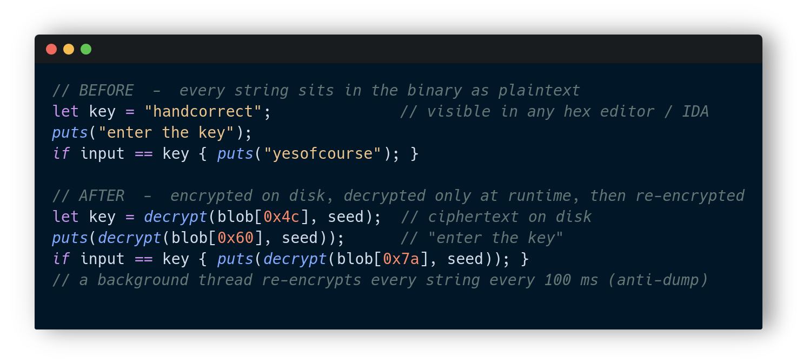
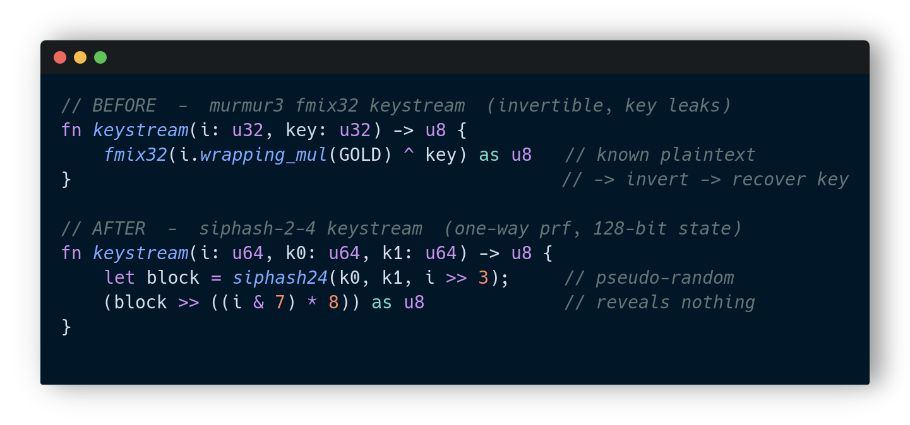
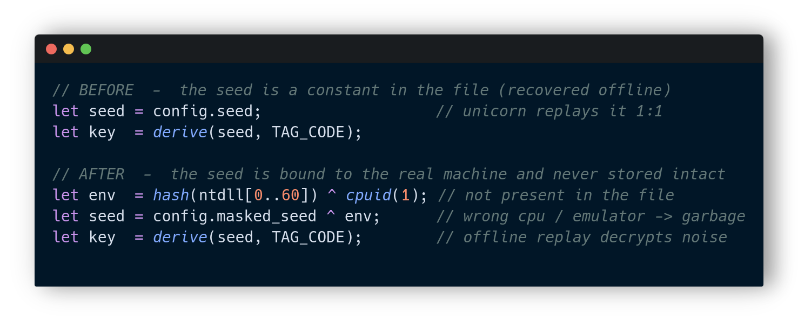
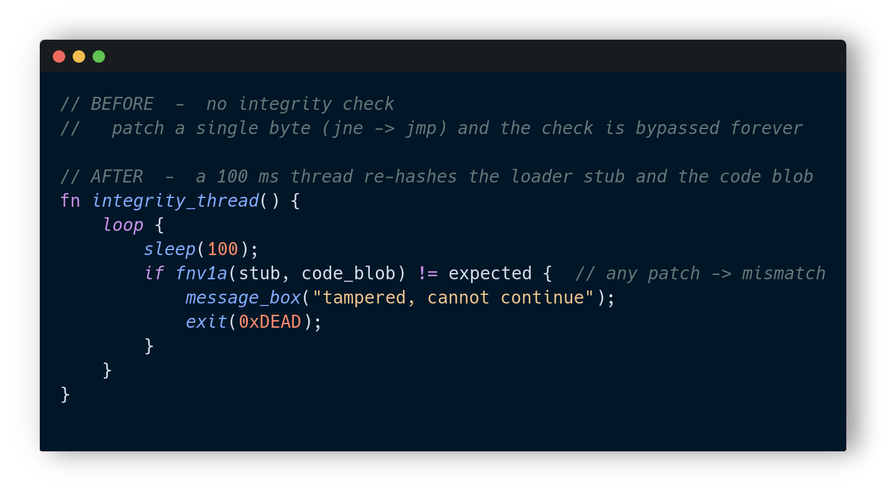

# CompotProtector

A custom Windows x64 PE protector written in Rust, with both a GUI (egui) and an
auto-activated CLI. It takes an input `.exe`, applies a layered set of obfuscation
and anti-analysis transforms, and writes a hardened binary that still runs
natively. It targets both MinGW and MSVC produced binaries.

This is a research / educational project exploring how modern packers raise the
bar against static analysis, emulation, debugging and tampering. It is not meant
for shipping malware.

---

## Highlights

- Whole-string encryption with runtime decryption and a re-encryption thread
- Import hiding by hash resolution, IAT destruction and data-directory poisoning
- TLS-callback injection that decrypts the loader before the entry point
- Whole `.text` encryption, zeroed on disk and restored at runtime
- Bounded code virtualization (a small custom VM for marked regions)
- Anti-debug through ntdll inline-hook detection (defeats ScyllaHide setups)
- Anti-attach watchdog that corrupts behaviour when a debugger attaches
- Anti-emulation: the seed is bound to the real machine (CPUID + ntdll)
- Runtime integrity / anti-tamper checks every 100 ms
- SipHash-2-4 keystream cipher with a 64-bit, machine-bound seed
- Symbol and debug stripping, randomized realistic section names

---

## What it does, before and after

### String protection

Strings never appear in the file. They are decrypted only at runtime and a
background thread keeps re-encrypting them, so a memory dump while the process
idles shows ciphertext.



### Keystream cipher

The original Murmur3 `fmix32` keystream was invertible: a known plaintext let an
analyst recover the seed and unlock everything. It was replaced with SipHash-2-4,
a vetted one-way keyed PRF, so a known plaintext reveals nothing about the key.



### Anti-emulation seed

The decryption seed used to be a constant stored in the file, which an offline
emulator (Unicorn) could replay one to one. Now the seed is XOR-mixed with a hash
of the real `ntdll` header and the result of `CPUID`, so it is never stored intact
and only resolves on the target machine.



### Runtime integrity

A dedicated thread re-hashes the loader stub and the encrypted code blob every
100 ms. Any patch, on disk or in memory, is detected and the process exits with
an error.



---

## Protection layers

```
input.exe
   |
   strip symbols / debug
   encrypt every string        (siphash-2-4, machine-bound seed)
   hide imports                (hash resolve + iat destroy + dir poison)
   encrypt .text               (zeroed on disk, restored at runtime)
   virtualize marked regions   (bounded custom vm)
   install tls callback        (decrypts the loader before entry)
   anti-debug / anti-attach / anti-emulation / integrity
   |
output.exe   ->   runs natively, decrypts itself in memory only
```

---

## Build

Requires the Rust toolchain (Gradle is not used here) plus a MinGW / clang setup
for reassembling the position-independent loader stub.

```
cargo build --release
```

The protector binary is produced under `target/release/`.

## Usage

CLI mode is activated automatically when arguments are passed:

```
comprotector -i path/to/input.exe -o path/to/output.exe
comprotector -i input.exe -o output.exe --lazy        # on-demand page decrypt
comprotector -i input.exe -o output.exe --min-len 3   # string scan threshold
```

Run with no arguments to open the GUI.

---

## Disclaimer

For learning and research only. Do not use it to obfuscate malicious software or
to circumvent protections you do not own.
