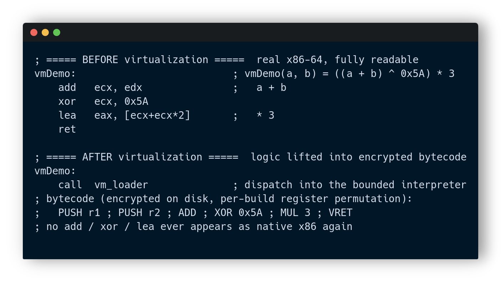
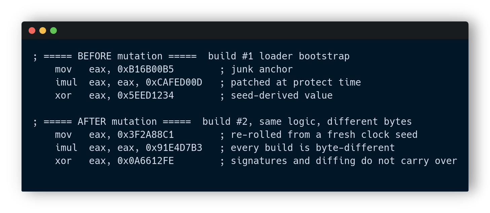
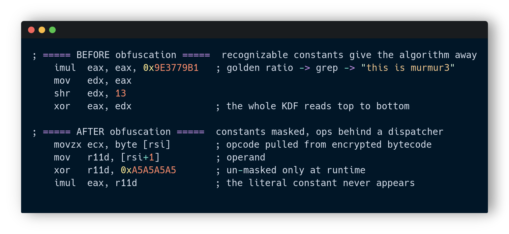

# CompotProtector


A custom Windows x64 PE protector written in Rust, with both a GUI (egui) and an
auto-activated CLI. It takes an input `.exe`, applies a layered set of obfuscation,
virtualization and anti-analysis transforms, and writes a hardened binary that
still runs natively. It targets both MinGW and MSVC produced binaries.

> This is a research and educational project that explores how modern packers
> raise the bar against static analysis, emulation, debugging and tampering.
> It is not meant for shipping malware.

---

## Contents

- [Overview](#overview)
- [Feature map](#feature-map)
- [Protection internals](#protection-internals) - virtualization, mutation, obfuscation
- [Runtime protections](#runtime-protections) - strings, cipher, seed, integrity
- [Protection pipeline](#protection-pipeline)
- [Strengths and limitations](#strengths-and-limitations)
- [Roadmap and TODO](#roadmap-and-todo)
- [Build and usage](#build-and-usage)
- [Disclaimer](#disclaimer)

---

## Overview

The protector runs a chain of independent passes over the PE. Each pass is
composable and can be toggled from the CLI or the GUI. The output binary carries
a small position-independent loader stub, injected as a TLS callback, that
reverses the transforms in memory before the original entry point runs. Nothing
is written back to disk: the protected file stays encrypted on disk for its whole
lifetime.

---

## Feature map

| Area | What it does |
|------|--------------|
| Strings | Whole-string encryption, runtime decrypt, periodic re-encryption (anti-dump) |
| Imports | Hash resolution, IAT destruction, data-directory poisoning, name scrambling |
| Code | Whole `.text` encryption, zeroed on disk, restored and re-protected at runtime |
| Virtualization | A bounded custom VM for marked regions (works on MinGW and MSVC) |
| Loader | TLS-callback injection that decrypts the stub before the entry point |
| Cipher | SipHash-2-4 keystream, one-way PRF, 64-bit machine-bound seed |
| Anti-debug | ntdll inline-hook detection (defeats default ScyllaHide profiles) |
| Anti-attach | Watchdog thread that corrupts behaviour when a debugger attaches |
| Anti-emulation | Seed bound to the real machine via CPUID and the ntdll header |
| Anti-tamper | A dedicated thread re-hashes the stub and code blob every 100 ms |
| Polymorphism | Per-build seed, junk, keys and VM register layout - no two builds match |

---

## Protection internals

Three transforms operate at the instruction level. The snippets below are written
as x86-64 flow plus VM bytecode to show what an analyst sees before and after each
pass.

### Virtualization

A marked function is lifted into bytecode for a small bounded interpreter. The
native `add` / `xor` / `lea` are gone; only a dispatch into the VM remains, and the
bytecode itself is encrypted on disk with a per-build register permutation. To read
the logic an analyst has to reverse the interpreter first, then decode the bytecode.



Before: a clean four-instruction function anyone can read.
After: a single `call vm_loader` plus an encrypted bytecode stream. The arithmetic
exists only as VM operations that never touch the native instruction stream.

### Mutation

Mutation here is polymorphism: the same logical code is emitted with different
bytes on every build. The loader bootstrap carries junk anchors that are patched
from a fresh clock seed, the cipher keys change, and the VM permutes its register
mapping. The result is that signatures, hashes and binary diffing do not carry
from one build to the next.



Note: this is build-time polymorphism, not per-run self-modifying mutation of
arbitrary functions. True instruction-level mutation of compiled code is unstable
(it shifts every relative jump, RIP-relative reference and unwind record), so the
project encrypts code instead and mutates the parts it controls. See the TODO.

### Obfuscation

The recognizable constants that used to give the key-derivation away were moved
behind a dispatcher and masked. A literal like the golden-ratio constant no longer
appears in the disassembly; operands are pulled from encrypted bytecode and
un-masked only at runtime.



Before: the KDF reads top to bottom and a single `grep` for the constant names the
algorithm. After: the constant is never a literal, the ops sit behind a dispatch
loop, and identification by pattern matching fails.

---

## Runtime protections

### String protection

Strings never appear in the file. They are decrypted only at runtime and a
background thread keeps re-encrypting them, so a memory dump while the process
idles shows ciphertext rather than text.


### Keystream cipher

The original Murmur3 `fmix32` keystream was invertible: a known plaintext let an
analyst recover the seed and unlock everything. It was replaced with SipHash-2-4,
a vetted one-way keyed PRF, so a known plaintext reveals nothing about the key.


### Anti-emulation seed

The decryption seed used to be a constant stored in the file, which an offline
emulator such as Unicorn could replay one to one. Now the seed is XOR-mixed with a
hash of the real ntdll header and the result of `CPUID`, so it is never stored
intact and only resolves on the target machine.


### Runtime integrity

A dedicated thread re-hashes the loader stub and the encrypted code blob every
100 ms. Any patch, on disk or in memory, is detected and the process exits with an
error dialog.


---

## Protection pipeline

```
input.exe
   |
   strip symbols / debug
   virtualize marked regions   (bounded custom vm, per-build register layout)
   encrypt every string        (siphash-2-4, machine-bound seed)
   hide imports                (hash resolve + iat destroy + dir poison)
   encrypt .text               (zeroed on disk, restored and re-protected at runtime)
   install tls callback        (decrypts the stub before the entry point)
   anti-debug / anti-attach / anti-emulation / integrity
   randomize section names, poison data directories
   |
output.exe   ->   runs natively, decrypts itself in memory only
```

---

## Strengths and limitations

### Strengths

- Layered and composable: every pass is independent and toggleable.
- Works on both MinGW and MSVC binaries, with a GUI and a CLI.
- One-way cipher plus a machine-bound seed defeat trivial offline static recovery
  and the demonstrated Unicorn replay attack.
- Anti-dump: strings and code are re-encrypted while the process is idle.
- ntdll inline-hook anti-debug catches default ScyllaHide setups.
- The bounded VM and the whole-`.text` zeroed-on-disk view make a first look in a
  disassembler show nothing useful.
- Per-build polymorphism breaks signatures and diffing.
- Fast: protection takes a fraction of a second and runtime overhead is modest.

### Limitations

- Unpacking paradox: a self-unpacking binary is ultimately unpackable by a
  determined analyst, because the decryptor and all key material ship inside it.
  Every layer raises cost, none makes it impossible.
- The CPUID node-lock binds to a CPU model, so the output is not portable across
  different CPU families.
- The loader bootstrap is necessarily plaintext (it bootstraps decryption), so the
  outermost layer is always readable.
- The seed is 64-bit, not 128-bit; on the target machine a brute-force is
  theoretically possible (though expensive).
- Anti-debug and anti-tamper are usermode, so they are patchable and a tuned
  ScyllaHide profile can still slip past some checks.
- No real control-flow obfuscation (no CFG flattening or MBA) yet.
- File size grows because the encrypted code blob duplicates `.text`.

---

## Roadmap and TODO

### Not implemented yet

- Literal 128-bit seed (current seed is 64-bit; needs a two-key cipher path).
- True instruction-level code mutation (only build-time polymorphism today).
- Delay-imports hiding.
- Control-flow obfuscation: CFG flattening, opaque predicates, MBA expressions.
- VM memory and call opcodes (the interpreter is integer-ALU only and bounded).
- External or online key / hardware-bound key beyond the CPU model.

### Implemented but weak

- Loader obfuscation is light; the bootstrap and the cipher are still readable.
- Anti-debug is usermode and patchable; hook detection only catches what hooks.
- The integrity checker lives inside the same protected stub, so it can itself be
  patched out before it runs (the runtime thread narrows but does not close this).
- Seed entropy comes mostly from the clock, which bounds real unpredictability.
- The output structure still looks packed (no imports, high entropy) even with
  realistic section names.
- The short `"> "` string is below the scan threshold and stays plaintext.
- The tamper response uses a blocking message box, so the dialog has GUI latency.

### Done well, but improvable forever

- SipHash-2-4 one-way keystream cipher.
- Whole-string encryption with runtime re-encryption (anti-dump).
- Whole-`.text` encryption with the zeroed-on-disk view.
- CPUID and ntdll anti-emulation seed binding.
- Import hiding, IAT destruction and data-directory poisoning.
- ntdll inline-hook anti-debug.
- The bounded VM across MinGW and MSVC.
- The 100 ms runtime integrity thread.
- Per-build polymorphism.

---

## Build and usage

Requires the Rust toolchain plus a MinGW / clang setup for reassembling the
position-independent loader stub.

```
cargo build --release
```

The protector binary is produced under `target/release/`.

CLI mode activates automatically when arguments are passed:

```
comprotector -i input.exe -o output.exe
comprotector -i input.exe -o output.exe --lazy          # on-demand page decrypt
comprotector -i input.exe -o output.exe --min-len 3     # string scan threshold
comprotector -i input.exe -o output.exe --no-anti-debug # disable anti-debug
comprotector -i input.exe -o output.exe --no-virtualize # disable the vm pass
```

Run with no arguments to open the GUI.

---

## Disclaimer

For learning and research only. Do not use it to obfuscate malicious software or
to circumvent protections you do not own.
